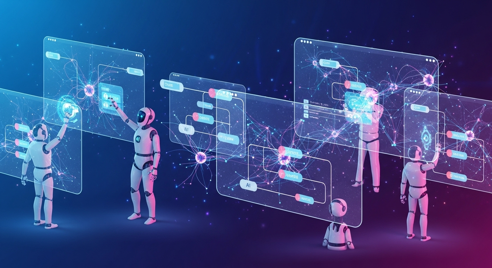

# 🌐 Iris Networks
**Building the Future of Computer Use Agents for RPA**

<div align="center">
  
</div>

## 🚀 What We Do

Iris Networks is pioneering the next generation of **Computer Use Agents** for Robotic Process Automation (RPA). Our AI-powered agents can understand, interact with, and automate complex computer tasks just like a human would.

### 🎯 Key Features

- **🤖 Intelligent Computer Use** - AI agents that can see, click, type, and navigate any application
- **⚡ Advanced RPA** - Automate complex workflows across multiple applications
- **🧠 AI-Powered Decision Making** - Smart agents that adapt to changing interfaces
- **🔗 Seamless Integration** - Works with existing tools and workflows
- **📊 Real-time Monitoring** - Track and optimize automation performance

## 🛠 Technology Stack

<div align="center">
  
</div>

Our computer use agents leverage cutting-edge AI technologies:

<table>
<tr>
<td width="50%">

- **Computer Vision** - Advanced screen understanding and element detection
- **Natural Language Processing** - Convert human instructions to automated actions
- **Machine Learning** - Continuous improvement and adaptation
- **Multi-Modal AI** - Combined vision, text, and action understanding

</td>
<td width="50%">

<div align="center">
  
</div>

</td>
</tr>
</table>

## 🎯 Use Cases

### Business Process Automation
- Data entry and migration
- Invoice processing
- Report generation
- Customer service workflows

### Development & Testing
- Automated testing across applications
- Deployment workflows
- Code review processes
- Quality assurance tasks

### Enterprise Operations
- System monitoring and maintenance
- Backup and recovery procedures
- Compliance reporting
- Inventory management

## 🚀 Getting Started

```bash
# Coming Soon - Installation instructions
npm install @iris-networks/computer-use-agent

# Or using pip
pip install iris-computer-use
```

## 🌟 Why Choose Iris Networks?

| Feature | Traditional RPA | Iris Computer Use Agents |
|---------|----------------|-------------------------|
| **Adaptability** | Brittle, breaks with UI changes | ✅ AI-powered, adapts to changes |
| **Setup Time** | Weeks of configuration | ✅ Minutes with natural language |
| **Maintenance** | Constant updates needed | ✅ Self-healing and adaptive |
| **Complexity** | Limited to simple tasks | ✅ Handles complex workflows |

## 📈 Performance Metrics

<div align="center">
  
</div>

<div align="center">

| Metric | Performance |
|--------|-------------|
| **🎯 Task Completion Accuracy** | **99.5%** |
| **⚡ Deployment Speed** | **10x** Faster than traditional RPA |
| **🔧 Maintenance Reduction** | **80%** Less overhead |
| **🕐 Operation Capability** | **24/7** Continuous |

</div>

## 🔮 Coming Soon

- [ ] Multi-application workflow orchestration
- [ ] Advanced natural language task creation
- [ ] Real-time collaboration with human operators
- [ ] Enterprise-grade security and compliance
- [ ] Cloud and on-premise deployment options

## 🤝 Contributing

We're building the future of computer automation. Join us!

- 🐛 Report bugs and issues
- 💡 Suggest new features
- 🔧 Contribute to development
- 📖 Improve documentation

## 📞 Contact

- **Website**: [iris-networks.ai](https://iris-networks.ai)
- **Email**: hello@iris-networks.ai
- **LinkedIn**: [Iris Networks](https://linkedin.com/company/iris-networks)
- **Twitter**: [@IrisNetworksAI](https://twitter.com/IrisNetworksAI)

## 📄 License

Copyright © 2024 Iris Networks. All rights reserved.

---

<div align="center">
  <strong>🌟 Star this repo to stay updated on our latest developments! 🌟</strong>
</div>

<div align="center">
  
</div>